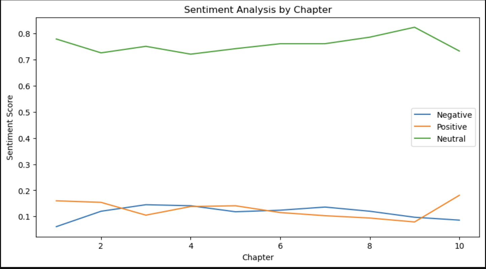

# Book Sentiment Analysis using NLTK

A Python-based Natural Language Processing (NLP) project that analyzes the sentiment of text taken from a book using the NLTK library.

The project shows text preprocessing, regular expression-based chapter extraction, and sentiment analysis using the VADER sentiment analyzer.

---

## Features

- Extract chapters using Regular Expressions
- Process large text files
- Perform sentiment analysis using NLTK VADER
- Calculate:
  - Positive sentiment
  - Negative sentiment
  - Neutral sentiment
  - Compound sentiment score
- Visualize sentiment trends across chapters
- Jupyter Notebook implementation

---

## Technologies Used

- Python
- NLTK
- Regular Expressions (re)
- Pandas
- Matplotlib
- Jupyter Notebook

---

## Project Structure
project-analyze-eBooks/
│
├── miracle_in_the_andes.txt
├── nltk_book_analysis.ipynb
├── regEx_analysis.ipynb
├── requirements.txt
├── README.md
└── .gitignore

---

## Dataset

The project uses the book:

**Miracle in the Andes**
by Nando Parrado

The text file is used for educational and sentiment-analysis purposes.

---

## Workflow

### 1. Load Book

Read the text file into Python.

### 2. Extract Chapters

Use Regular Expressions to identify chapter headings and split the text into chapters.

Example:

```python
pattern = re.compile("Chapter [0-9]+")

```

### 3. Sentiment Analysis

Apply NLTK’s VADER sentiment analyzer:
```python
from nltk.sentiment import SentimentIntensityAnalyzer
```

### 4. Visualization

Plot sentiment scores chapter-by-chapter to observe emotional changes throughout the book.

Learning Outcomes

#### This project helped develop skills in:

* Natural Language Processing
* Sentiment Analysis
* Text Mining
* Regular Expressions
* Data Visualization
* Python Programming

### Author
- Anjali Chauhan
- BTech CSE (AI/ML)